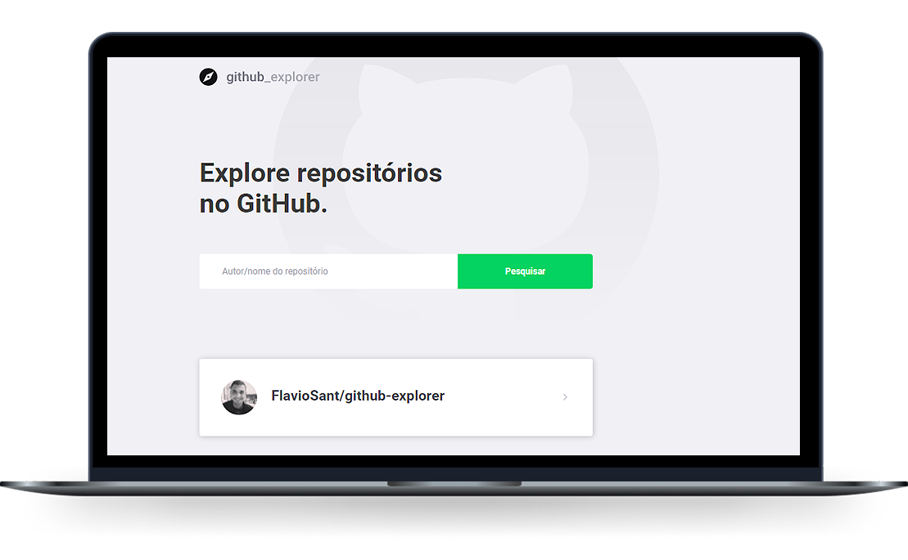

<h2 align="center">
  
</h2>

<p align="center">
  <a href="#-projeto">Projeto</a>&nbsp;&nbsp;&nbsp;|&nbsp;&nbsp;&nbsp;
  <a href="#-tecnologias-utilizadas">Tecnologias Utilizadas</a>&nbsp;&nbsp;&nbsp;|&nbsp;&nbsp;&nbsp;
  <a href="#-demo">Demo</a>&nbsp;&nbsp;&nbsp;|&nbsp;&nbsp;&nbsp;
  <a href="#-como-executar">Como executar</a>&nbsp;&nbsp;&nbsp;|&nbsp;&nbsp;&nbsp;
  <a href="#-licença">Licença</a>
</p>

<p align="center">
  
</p>

<br>

<p align="center">
  
</p>

## 💻 Projeto

O GitHub Explorer é um projeto simples para buscar respositórios, visualizar detalhes, issues abertas e etc.

## 🚀 Tecnologias utilizadas

Esse projeto foi desenvolvido com as seguintes tecnologias:

- [React](https://reactjs.org)
- [Next.js](https://nextjs.org/)
- [TypeScript](https://www.typescriptlang.org/)

## 🎥 Demo

<a href="https://githubexplorerfs.vercel.app/">
  
</a>

## 🏁 Como executar

- Você precisa instalar o [Node.js](https://nodejs.org/en/) e [Yarn](https://yarnpkg.com/) para executar este projeto.

**Clone o projeto:**

```bash
  git clone https://github.com/FlavioSant/github-explorer.git
```

**Siga os passos abaixo:**

```bash
# Acesse a pasta github-explorer
cd github-explorer

# Instale as dependências
yarn

# Execute o servidor web
yarn dev
```

O GitHub Explorer estará rodando em seu navegador em: `http://localhost:3000`

## 📄 Licença

Esse projeto está sob a licença MIT. Veja o arquivo [LICENSE](LICENSE) para mais detalhes.

---

Desenvolvido por Flávio Santos.
